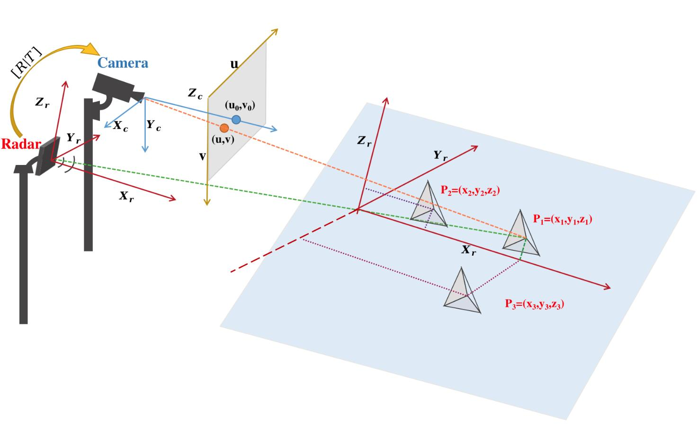

# Radar Group at University of Arizona

**Focus Areas**: Radar Signal Processing, Multimodal Sensor Fusion, Machine
Learning for Sensors, Radar Imaging

---

## Research Areas

### 1. Human Pose Estimation using mmWave Radar

More Information

**Description**: Development of **mmPose-FK**, a novel mmWave radar-based pose
estimation method using dynamic forward kinematics (FK) to overcome challenges
like low resolution and noise. Achieves stable joint tracking via deep learning
integration.

**Key Papers**:

1. **mmPose-FK: A Forward Kinematics Approach to Dynamic Skeletal Pose
   Estimation**  
   _S. Hu, S. Cao et al._  
   _IEEE Sensors Journal_, 2024.
2. **mmPose-NLP: A Natural Language Processing Approach**  
   _A. Sengupta, S. Cao_  
   _IEEE Transactions on Neural Networks and Learning Systems_, 2023.
3. **Real-Time Pose Estimation with CNNs**  
   _A. Sengupta et al._  
   _IEEE Sensor Journal_, 2020.

---

### 2. Radar-Based Fall Detection

More Information

**Description**: A privacy-preserving system using mmWave radar and deep
learning (CNNs, RNNs) to detect falls in real time. Addresses challenges like
obstructions and data scarcity.

**Key Papers**:

1. **Radar-Based Fall Detection: A Survey**  
   _S. Hu, S. Cao et al._  
   _IEEE Robotics and Automation Magazine_, 2024.
2. **mmFall: Fall Detection Using Hybrid Variational RNN AutoEncoder**  
   _F. Jin et al._  
   _IEEE Transactions on Automation Science and Engineering_, 2020.

---

### 3. Multimodal Sensor Calibration

#### Target-Based Calibration

More Information

**Description**: Flexible extrinsic calibration of 3D radar and camera using a
single corner reflector. Solves PnP with RANSAC and LM optimization.

**Key Paper**:

-   **3D Radar-Camera Co-Calibration**  
    _L. Cheng et al._  
    _IEEE Radar Conference_, 2023.

#### Targetless Calibration

More Information

**Description**: Online calibration via deep learning to extract common features
from radar (Range-Doppler-Angle) and camera data.

Specifically, the extracted common feature serves as an example to demonstrate
an online targetless calibration method between the radar and camera systems.
The estimation of the extrinsic transformation matrix is achieved through this
feature-based approach. To enhance the accuracy and robustness of the
calibration, we apply the RANSAC and Levenberg-Marquardt (LM) nonlinear
optimization algorithm for deriving the matrix. Additionally, we incorporate
adaptive variance measures to ensure efficiency during the optimization process.

**Key Paper**:

-   **Online Targetless Calibration Using Common Features**  
    _L. Cheng, S. Cao_  
    _IEEE National Aerospace and Electronics Conference_, 2023.

---

### 4. Multimodal Sensor Fusion for Object Tracking

#### Deep Learning-Based Tracking

More Information

    

**Description**: Fusion of radar and camera data using Bi-directional LSTM and
tri-output mechanisms for robust tracking.

**Key Paper**:

-   **Robust Multi-Object Tracking via Radar-Camera Fusion**  
    _L. Cheng et al._  
    _IEEE Transactions on Intelligent Transportation Systems_, 2024.

#### Kalman Filter-Based Tracking

More Information

**Description**: Decision-level fusion with tri-Kalman filters for localization
accuracy and robustness.

**Key Paper**:

-   **Robust Tracking Using Radar-Camera Fusion**  
    _A. Sengupta et al._  
    _IEEE Sensors Letters_, 2022.

---

### 5. Automotive Radar Interference Mitigation

More Information

  
**Description**: Adaptive noise canceller for FMCW radar to improve SIR and
reduce ghost targets.

**Key Paper**:

-   **Interference Mitigation Using Adaptive Noise Canceller**  
    _F. Jin, S. Cao_  
    _IEEE Transactions on Vehicular Technology_, 2019.

---

### 6. Human Behavior Classification

More Information

  
**Description**: Real-time multi-patient behavior detection using mmWave radar
and CNNs.

**Key Papers**:

1. **Real-Time Behavior Detection**  
   _R. Zhang, S. Cao_  
   _IEEE Sensors Letters_, 2019.
2. **Multi-Patient Detection in Real-Time**  
   _F. Jin et al._  
   _IEEE Radar Conference_, 2019.

**Application**:

-   [SeVA Technology Demo](https://www.sevatec-llc.com/wp-content/uploads/2019/04/SeVA-Scenario-1-Patient-Waiving-Hand-for-Help.mp4)

---

### 7. Radar Imaging Techniques

More Information

  
**Description**: Portable 3D imaging using inverse Radon transform on mmWave
radar data.

**Key Papers**:

1. **Compressed Sensing for 3D Imaging**  
   _R. Zhang, S. Cao_  
   _IEEE Radar Conference_, 2017.
2. **Portable mmWave 3D Imaging**  
   _R. Zhang, S. Cao_  
   _IEEE Radar Conference_, 2017.

---

## Research Support

  
We gratefully acknowledge support from our sponsors.

---

**Contact**: [Lab Website](https://www2.engr.arizona.edu/~caos/index.html) |
[Email](mailto:caos@arizona.edu)  
_Last Updated: Feb 2025_
